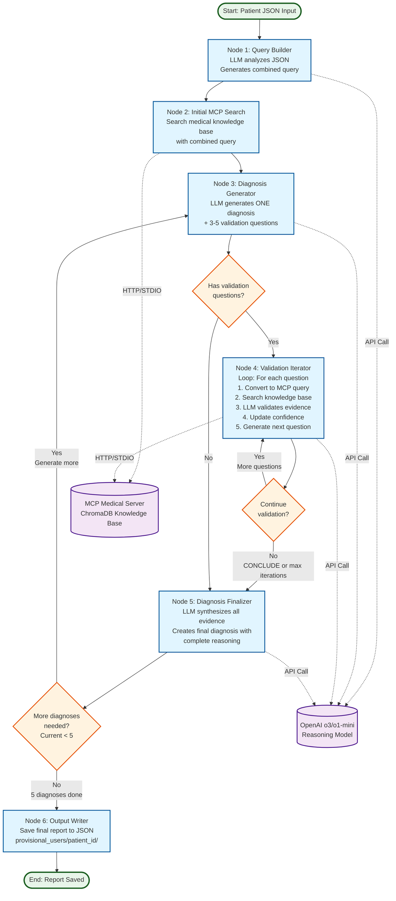

# Provisional Diagnosis System - Flow Diagram

## System Overview

### Main Flow
1. **Query Builder** - Analyzes patient JSON and creates a comprehensive search query
2. **Initial MCP Search** - Searches medical knowledge base with the combined query
3. **Diagnosis Generator** - Generates ONE provisional diagnosis with 3-5 validation questions
4. **Validation Iterator** - Loops through validation questions (3-5 iterations per diagnosis):
   - Converts question to MCP query
   - Searches medical knowledge base
   - LLM validates evidence and updates confidence
   - Generates next question or concludes
5. **Diagnosis Finalizer** - Synthesizes all evidence into final diagnosis with complete reasoning
6. **Output Writer** - Saves final report to JSON file

### Loops
- **Validation Loop**: Iterates 3-5 times per diagnosis (or until LLM says "CONCLUDE")
- **Diagnosis Loop**: Generates 5 different diagnoses total

### External Components
- **MCP Medical Server**: ChromaDB-based medical knowledge base (accessed via HTTP or STDIO)
- **OpenAI LLM**: o3 or o1-mini reasoning model for all LLM operations

### Output
Final report saved to: `provisional_users/{patient_id}/diagnosis_report_{timestamp}.json`

